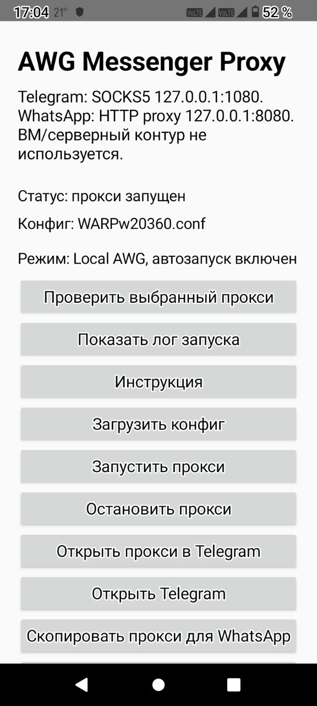

  

# AWG Messenger Proxy

Android-утилита запускает wireproxy-awg на телефоне и предоставляет Telegram
локальный SOCKS5-прокси 127.0.0.1:1080. Android VpnService не используется:
слот VPN остаётся свободным, системные маршруты не меняются, остальные
приложения работают напрямую.

  

## Как это устроено

Telegram подключается к SOCKS5 на 127.0.0.1:1080. Внутри процесса wireproxy
(gVisor netstack в памяти) трафик упаковывается в туннель AmneziaWG и уходит
с телефона обычным UDP-сокетом на сервер.

Приложение держит foreground-сервис, само перезапускает туннель при смене
Wi-Fi или мобильной сети и восстанавливает прокси после перезагрузки телефона.

## Возможности

- Импорт исходного AWG/WG-конфига на самом телефоне: утилита удаляет секцию
  [Socks5], добавляет локальную, проверяет результат встроенным wireproxy и
  только после успешной проверки сохраняет конфиг
- Автоперезапуск туннеля при смене сети
- Автостарт после перезагрузки телефона
- Один APK на три архитектуры: armeabi-v7a, arm64-v8a, x86_64

## Использование

1. Установить APK и открыть приложение
2. Нажать «Загрузить конфиг» и выбрать исходный .conf
3. Разрешить уведомления, нажать «Разрешить работу в фоне»
4. Дождаться статуса «прокси запущен» и нажать «Проверить выбранный прокси».
   Успех: «Туннель работает: N мс»
5. Нажать «Открыть прокси в Telegram» и один раз включить прокси в Telegram

## Сборка из исходников

Бинарник wireproxy (Go 1.26, NDK r27c), пример для arm64:

    cd build-src/wireproxy-awg-1.0.16
    export NDK=/путь/к/android-ndk
    CGO_ENABLED=1 CC=$NDK/toolchains/llvm/prebuilt/linux-x86_64/bin/aarch64-linux-android23-clang \
      GOOS=android GOARCH=arm64 go build -trimpath -ldflags "-s -w" \
      -o ../../app/src/main/jniLibs/arm64-v8a/libwireproxy.so ./cmd/wireproxy

Аналогично собираются armeabi-v7a (GOARCH=arm GOARM=7) и x86_64 (GOARCH=amd64).

APK (Gradle 8.9, Android SDK 35, Java 17):

    gradle :app:assembleDebug

## Структура репозитория

    app/          Android-приложение (Java, без внешних зависимостей)
    build-src/    исходники wireproxy-awg 1.0.16 и config-adapter
    tools/        prepare-config.sh, подготовка конфига на компьютере
    dist/         готовые APK и SHA256SUMS

## Авторы и лицензии

Проект не является автором wireproxy. В build-src/wireproxy-awg-1.0.16/
находятся исходники стороннего проекта; все файлы идентичны апстриму
v1.0.16, кроме добавленного здесь cmd/config-adapter/.

- wireproxy-awg — https://github.com/artem-russkikh/wireproxy-awg,
  форк wireproxy с поддержкой AmneziaWG, лицензия ISC
- wireproxy — https://github.com/windtf/wireproxy, автор Tsz Fung Wong,
  лицензия ISC, файл LICENSE сохранён в build-src/wireproxy-awg-1.0.16/LICENSE
- amneziawg-go — https://github.com/amnezia-vpn/amneziawg-go, лицензия MIT,
  основан на wireguard-go (https://github.com/WireGuard/wireguard-go, MIT)

WireGuard является зарегистрированной торговой маркой Jason A. Donenfeld.

## Приватность

Приватные ключи существуют только в конфиге на телефоне и в исходном .conf.
В репозитории ключей нет.
